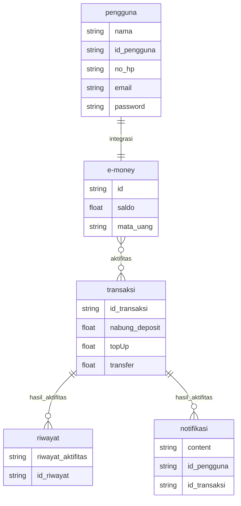

# Database sistem e-money markdown

MArkdown untuk simulasi database e-money, yang menggunakan entitas pengguna, e-money, transaksi, riwayat dan notifikasi

## 📸 Preview

## 🛠️ Tech Stack

**Mermaid**
tech untuk membuat mermaid

**Git** — untuk version control dan kolaborasi

## 🤝 How to Contribute

Kontribusi selalu diterima! Berikut cara untuk berkontribusi:

1. Fork repository ini
2. Buat branch baru untuk fitur Anda (`git checkout -b feature/AmazingFeature`)
3. Commit perubahan Anda (`git commit -m 'Add some AmazingFeature'`)
4. Push ke branch (`git push origin feature/AmazingFeature`)
5. Buat Pull Request

### Aturan Kontribusi

- Pastikan code Anda mengikuti style guide yang ada
- Tulis commit message yang jelas dan deskriptif
- Update dokumentasi jika diperlukan
- Tambahkan tests untuk fitur baru
