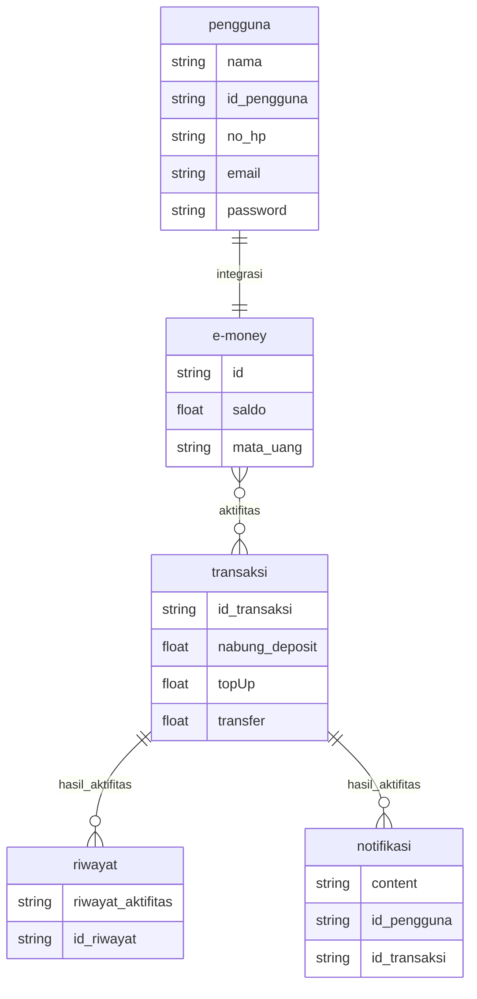

```mermaid
erDiagram
   pengguna {
        string nama
        string id_pengguna
        string no_hp
        string email
        string password
    }

    e-money {
        string id
        float saldo
        string mata_uang
    }

    transaksi {
        string id_transaksi
        float nabung_deposit
        float topUp
        float transfer
    }
    riwayat {
        string riwayat_aktifitas
        string id_riwayat
    }
    notifikasi {
        string content
        string id_pengguna
        string id_transaksi
    }

    pengguna ||--|| e-money : integrasi
    e-money }o--o{ transaksi : aktifitas
    transaksi ||--o{ riwayat : hasil_aktifitas
    transaksi || --o{ notifikasi : hasil_aktifitas

```
